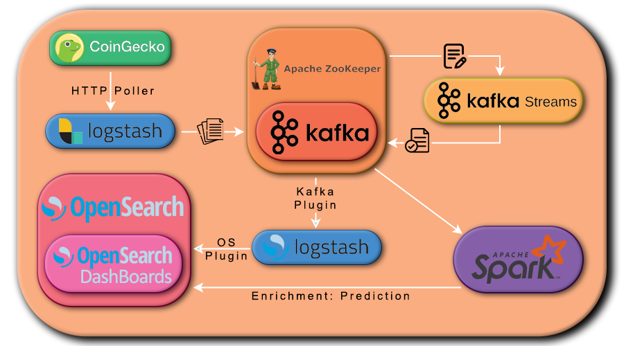

# CryptoSight

## Brief Summary

This project is related to the course _Technologies for Advanved Programmig_ of UniCT.
Questo è il progetto dedicato al corso Technologies for Advanced Programming dell'UniCT.

The main aim of this project is to make use of the skills obtained with the course by creating a full working pipeline. 

My project is a simple cryptocurrency tracker, with a small application of Machine Learning.

With this project you can track the current price, total volume, market cap, circulating supply of a small group of selected coins.

This project is for only **educational purpose**, it is not something that can be deployed of a production environment.

## Pipeline's Scheme

## Uselful Links

| Service               | URL                     |
| --------------------- | ----------------------- |
| KafkaUI               | http://localhost:8080   |
| OpenSearch Endpoint   | https://localhost:9200/ |
| OpenSearch Dashboards | http://localhost:5601   |
